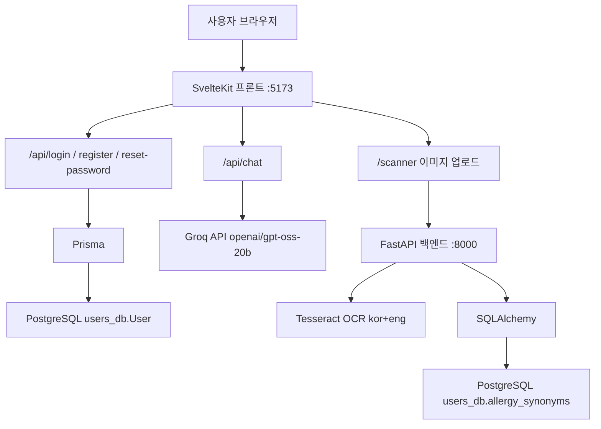

# 엘리 (Ellie)

대구가톨릭대학교 2024–25 캡스톤디자인 팀프로젝트입니다. 가공식품 성분표 사진을 올리면 OCR로 글자를 읽고, 식약처 라벨의 **함유** 표시를 알레르기 DB와 비교한 뒤 챗봇으로 결과를 알려줍니다.

## 주요 기능

- 성분표 이미지 업로드 후 Tesseract OCR(`kor+eng`)로 텍스트 추출
- 라벨의 **함유** 구간만 매칭 (혼입 가능 / 같은 제조시설은 제외)
- `allergy_synonyms.warning`으로 성분별 주의 문구를 문장형으로 안내
- 회원가입 / 로그인 / 비밀번호 재설정
- Groq 기반 식품 알레르기 챗봇 (엘리). 텍스트 질문은 마크다운 없이 짧은 문단으로 답함
- 스캐너에서 업로드한 사진을 유저 말풍선에 미리보기로 표시

## 구조

```
capstone/
├── backend/     # FastAPI + Tesseract OCR + SQLAlchemy
├── frontend/    # SvelteKit + Prisma (별도 git 저장소)
└── images/      # 테스트·문서용 이미지
```



프론트엔드는 이 저장소 안에서 [git 서브모듈](https://github.com/JEONGM1N-LEE/cap3_frontend)처럼 따로 관리됩니다. 프론트 파일만 고칠 때는 `frontend` 폴더의 git 이력을 확인하세요.

## 기술 스택

| 구분 | 기술 |
|------|------|
| 프론트엔드 | SvelteKit, TypeScript, Prisma |
| 백엔드 | FastAPI, SQLAlchemy, Tesseract OCR |
| 데이터베이스 | PostgreSQL (`users_db`) — `User`, `allergy_synonyms` |
| 챗봇 | Groq (`openai/gpt-oss-20b`) |

자세한 실행 방법은 아래를 참고하세요.

- [backend/README.md](backend/README.md)
- [frontend/README.md](frontend/README.md)

## 사전 준비

- Python 3.11+
- Node.js 20+
- PostgreSQL, 데이터베이스 이름 `users_db`
- [Tesseract OCR](https://github.com/UB-Mannheim/tesseract/wiki) (한글 데이터 `kor` 포함)
- Groq API 키 ([console.groq.com](https://console.groq.com))

## 빠르게 실행하기

저장소 **루트**에서 백엔드를 띄웁니다. import가 `backend.*`이라 `backend` 폴더에서 실행하면 실패합니다.

```powershell
cd C:\Users\user\Desktop\capstone
python -m venv .venv
.\.venv\Scripts\Activate.ps1
pip install -r backend/requirements.txt
uvicorn backend.main:app --reload --port 8000
```

CMD에서는 `Activate.ps1`이 메모장으로 열릴 수 있습니다. 그때는 활성화 없이 실행하세요.

```cmd
cd C:\Users\user\Desktop\capstone
.venv\Scripts\activate.bat
uvicorn backend.main:app --reload --port 8000
```

또는

```cmd
.venv\Scripts\uvicorn.exe backend.main:app --reload --port 8000
```

다른 터미널에서 프론트엔드를 띄웁니다.

```powershell
cd frontend
copy .env.example .env
npm install
npx prisma generate
npm run dev
```

`frontend/.env`에 실제 `DATABASE_URL`과 `GROQ_API_KEY`를 넣은 뒤 SvelteKit 서버를 재시작하세요. `.env`는 Git에 올리지 않습니다.

브라우저에서 [http://localhost:5173](http://localhost:5173) 로 접속하면 `/home`으로 이동합니다. OCR을 쓰려면 FastAPI가 `:8000`에서 켜져 있어야 합니다.

## 환경 변수

| 파일 | 변수 | 용도 |
|------|------|------|
| `frontend/.env` | `DATABASE_URL` | Prisma 사용자 테이블 |
| `frontend/.env` | `GROQ_API_KEY` | `/api/chat` 챗봇 |
| `backend/.env` | `TESSERACT_CMD` | Tesseract 실행 파일 경로 (미설정 시 Windows 기본 경로 사용) |

백엔드 DB 접속 문자열은 현재 `backend/database.py`에 있습니다. 프론트 Prisma와 같은 PostgreSQL을 가리켜야 합니다.

## 데이터베이스

같은 `users_db`를 쓰지만 테이블은 역할이 다릅니다.

| 테이블 | 누가 | 역할 |
|--------|------|------|
| `"User"` | 프론트 Prisma | 회원가입, 로그인, 비밀번호 찾기 |
| `allergy_synonyms` | 백엔드 SQLAlchemy | 함유 성분 매칭 + `warning` 문구 |

`allergy_synonyms`에는 식약처 표시 대상 19종과 `warning` 컬럼이 있어야 합니다.

## 알려진 한계

- OCR이 표 칸의 `제품명`을 놓치면 답변에 “가공식품”으로 나옵니다.
- `달걀`을 `달갈`로 읽으면 알류가 빠질 수 있습니다. 동의어에 `달갈`, `전란액`을 넣어 두면 도움이 됩니다.
- 텍스트 챗은 Groq 일반 지식이며, 특정 제품 함유를 단정하지 않습니다. 정확한 함유는 사진 업로드를 권합니다.
