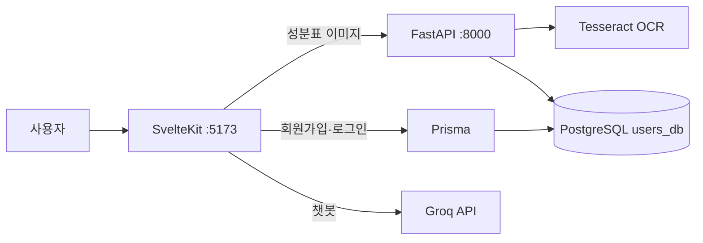

# 엘리 (Ellie)

대구가톨릭대학교 2024–25 캡스톤디자인 팀프로젝트입니다. 가공식품 성분표 사진을 올리면 OCR로 글자를 읽고, 알레르기 성분 DB와 비교한 뒤 챗봇으로 결과를 알려줍니다.

## 주요 기능

- 성분표 이미지 업로드 후 Tesseract OCR로 텍스트 추출
- PostgreSQL `allergy_synonyms` 테이블과 매칭해 알레르기 주의 문구 표시
- 회원가입 / 로그인 / 비밀번호 재설정
- Groq 기반 식품 성분 챗봇 (엘리)

## 구조

```
capstone/
├── backend/     # FastAPI + Tesseract OCR + SQLAlchemy
├── frontend/    # SvelteKit + Prisma (별도 git 저장소)
└── images/      # 발표·문서용 이미지
```



프론트엔드는 이 저장소 안에서 [git 서브모듈](https://github.com/JEONGM1N-LEE/cap3_frontend)처럼 따로 관리됩니다. 프론트 파일만 고칠 때는 `frontend` 폴더의 git 이력을 확인하세요.

## 기술 스택

| 구분 | 기술 |
|------|------|
| 프론트엔드 | SvelteKit, TypeScript, Prisma |
| 백엔드 | FastAPI, SQLAlchemy, Tesseract OCR |
| 데이터베이스 | PostgreSQL (`users_db`) |
| 챗봇 | Groq (`openai/gpt-oss-20b`) |

자세한 실행 방법은 아래를 참고하세요.

- [backend/README.md](backend/README.md)
- [frontend/README.md](frontend/README.md)

## 사전 준비

- Python 3.11+
- Node.js 20+
- PostgreSQL, 데이터베이스 이름 `users_db`
- [Tesseract OCR](https://github.com/tesseract-ocr/tesseract) (한글 데이터 `kor` 포함)
- Groq API 키

## 빠르게 실행하기

저장소 루트에서 백엔드를 띄웁니다.

```powershell
python -m venv .venv
.\.venv\Scripts\activate
pip install -r backend/requirements.txt
uvicorn backend.main:app --reload --port 8000
```

다른 터미널에서 프론트엔드를 띄웁니다.

```powershell
cd frontend
copy .env.example .env
npm install
npx prisma generate
npm run dev
```

`frontend/.env`에 실제 `DATABASE_URL`과 `GROQ_API_KEY`를 넣은 뒤 SvelteKit 서버를 재시작하세요. `.env`는 Git에 올리지 않습니다.

브라우저에서 [http://localhost:5173](http://localhost:5173) 로 접속하면 `/home`으로 이동합니다. OCR을 쓰려면 FastAPI가 `:8000`에서 켜져 있어야 합니다.

## 환경 변수

| 파일 | 변수 | 용도 |
|------|------|------|
| `frontend/.env` | `DATABASE_URL` | Prisma 사용자 테이블 |
| `frontend/.env` | `GROQ_API_KEY` | `/api/chat` 챗봇 |
| `backend/.env` | `TESSERACT_CMD` | Tesseract 실행 파일 경로 (미설정 시 Windows 기본 경로 사용) |

백엔드 DB 접속 문자열은 현재 `backend/database.py`에 있습니다. 프론트 Prisma와 같은 PostgreSQL을 가리켜야 합니다.
